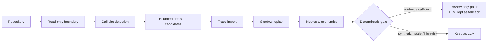

<div align="center">

# JevCostCutter

### Stop paying an LLM to do an if/else.

Find the bounded decisions hiding behind LLM calls in your codebase,<br/>
prove them with evidence, and get a review-only patch that keeps the LLM as fallback.<br/><br/>
<sub>CLI binary and Java packages: <code>jevopt</code></sub>


</div>

---

## The idea

A lot of production code sends a full LLM request to make a decision that is really bounded: route this ticket, retry or stop, pass a boolean gate, assign a score. JevCostCutter finds those call sites, measures them against the Jev decision engine in shadow mode, and tells you where an LLM is still the right tool and where it isn't.

**Models may provide judgments. Java owns authority.**



## Quick start

Requires Java 21+ on `PATH` or `JAVA_HOME`. The Gradle wrapper is included.

```sh
./gradlew clean build :jevopt-cli:installDist

# fully offline, no model involved
jevopt-cli/build/install/jevopt/bin/jevopt analyze --repo examples/synthetic-agent --offline --no-llm

# machine-readable output
jevopt-cli/build/install/jevopt/bin/jevopt analyze --repo examples/synthetic-agent --format json
```

Output on the bundled synthetic example:

```text
Suspected LLM call sites: 5
Bounded-decision candidates: 3
Keep as LLM: 2
Shadow validated: 0
Cost/savings: unknown (no runtime evidence or pricing)
Target writes: 0
Target commands executed: 0
Network requests: 0
```

Note the last three lines. JevCostCutter reports what it did *not* do, and an unknown cost stays unknown.

## Commands

| Command | Purpose |
|---|---|
| `init --state-dir <dir>` | Create external state in a new directory outside the target |
| `doctor` | Check environment and configuration |
| `analyze` | Inventory suspected LLM call sites and candidates |
| `candidates` · `explain <id>` | List candidates, explain one in detail |
| `traces import <file>` | Import strict JSON/JSONL evidence (trace v1–v3) |
| `shadow start --fixtures <file>` · `shadow status` · `shadow report` | Run and inspect shadow replay |
| `report` · `pricing` | Metrics and `BigDecimal` economics |
| `patch <id>` | Emit a review-only, fallback-preserving Java patch |
| `privacy-report` | Aggregate provider usage, bytes, tokens, redactions |
| `config` · `purge --confirm` · `version` | Configuration, explicit state purge, version |

Global options: `--repo`, `--format text|json`, `--offline`, `--no-llm`, `--provider none|codex|claude|ollama`, `--state-dir`, `--pricing`, plus explicit provider consent flags. Plain offline analysis is stateless; runtime and provider commands need initialized external state. Any eligible source change marks prior evidence stale.

## Security model

- **Read-only target.** No writes, no execution of target code, no credential-store inspection, no telemetry. Symlinks, non-regular files and oversized files are rejected; paths and secrets are redacted.
- **Network only on consent.** Jev replay talks to one fixed HTTPS host, with redirects disabled and bounded bytes, timeouts and retries. No socket opens without explicit consent; `--offline` rejects provider commands before invocation.
- **Sandboxed analyzers.** Codex and Claude run only a trusted configured executable with an argument array, scrubbed environment, empty temp directory, read-only sandbox, time and output caps, and strict JSON. Ollama is loopback-only and never auto-pulls.
- **Nothing raw at rest.** SQLite schema v4 stores sanitized evidence, replay results and aggregate usage only. Prompts, payloads, tokens and snippets are never persisted or logged.

Details: [SECURITY.md](SECURITY.md) · [threat model](docs/threat-model.md) · [architecture](docs/architecture.md) · [methodology](docs/methodology.md)

## Architecture

Twelve Gradle modules under `io.jevopt`:

```text
jevopt-core        shared model            jevopt-traces     strict evidence import
jevopt-security    read boundary, redact   jevopt-shadow     replay engine
jevopt-scanner     safe file walking       jevopt-jev        Jev client (opt-in)
jevopt-detectors   call-site detection     jevopt-economics  BigDecimal pricing
jevopt-report      text / JSON reports     jevopt-patch      review-only patches
jevopt-cli         entry point             jevopt-analyzers  Codex / Claude / Ollama SPI
```

## Verified release — `1.0.0-rc1`

Two clean builds with separate empty Gradle homes produced byte-identical TAR, ZIP, SBOM and checksum manifest. 92 tests, 0 failures. Privacy audit across 358 source, generated and archive items: 0 findings.

| Artifact | SHA-256 |
|---|---|
| `jevopt-1.0.0-rc1.tar` | `e578617bbfc701a34fb3efdf9c61b8d99703d201c612aa2e1197007d5dd40068` |
| `jevopt-1.0.0-rc1.zip` | `a12da747b9db72813025fea4f12d06c92e3e925b4e646d78dad31cde3bb50c62` |
| `jevopt.cdx.json` | `f97cb2a94d679c47ab7ee11a39865ac0f1d38b4dcf409425389db9f19ea4a595` |

Reproduce: `./gradlew clean build :jevopt-cli:installDist sbom checksums`

## Known limits

- Verified on synthetic data only. No production traces yet, so **no real savings claim is made**.
- Shadow mode measures agreement, not accuracy; accuracy needs labeled outcomes.
- Detection is conservative source analysis, not a full AST/dataflow engine.
- Patch generation covers one narrow Java direct-assignment pattern; compile and test of the patched code is reported as not run.
- No live provider has been contacted; contracts must be revalidated before a public release.

Full detail in [BUILD_STATUS.md](BUILD_STATUS.md) and [CHANGELOG.md](CHANGELOG.md).

## Contributing

Java 21, Gradle wrapper, `./gradlew clean build`. Security or detector changes need synthetic regression fixtures. Never add credentials or real traces. See [CONTRIBUTING.md](CONTRIBUTING.md).

## License

[MIT](LICENSE). Third-party notices in [THIRD_PARTY_NOTICES.md](THIRD_PARTY_NOTICES.md).

JevCostCutter is an independent open-source project. It is not affiliated with or endorsed by TypeSafe.
