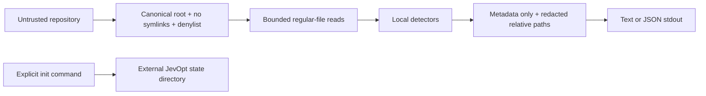

# Architecture decision: offline-first milestone

Models provide judgments; Java owns authority. This document records the original static foundation. The next milestone adds local traces, synthetic shadow replay and economics; see [runtime design](runtime-design.md). No network or process execution exists in the production path.

## A. Gradle module tree

```text
jevopt
  jevopt-core       domain records and detector interface
  jevopt-security   read boundary and redaction
  jevopt-scanner    bounded inventory
  jevopt-detectors  conservative source-pattern detectors
  jevopt-report     JSON/text renderer
  jevopt-cli        commands and explicit external state initialization
```

Later modules: traces, llm-spi, llm-codex, llm-claude, llm-ollama, llm-openai-compatible, jev, economics, patch, testkit. Do not create empty implementations that imply support.

## B. Core interfaces

`CallSiteDetector.detect(SourceFile)` returns candidate evidence. `RepositorySandbox.read(relativePath)` is the only source read boundary. `ReportRenderer` renders already minimized domain values. Future `AnalyzerProvider` accepts only sanitized bundles and returns schema-validated evidence, never authority.

## C. Domain records

`SourceFile(relativePath, language, content)` is ephemeral. `DecisionCandidate(candidateId, relativePath, startLine, framework, category, suggestedPrimitive, status, detectorConfidence, positiveSignals, negativeSignals, requiredEvidence, staticFingerprint)` persists no source. `AnalysisReport(filesScanned, filesSkipped, truncated, candidates, targetWrites, targetExecutions, networkRequests, limitations)` exposes coverage and explicit uncertainty.

## D. Security boundary



Source never controls network, shell, output destinations, or policy. Analyze is stateless and writes nothing, including no cache. Init requires an explicit state directory outside the repository; this deliberately strengthens the specification's target read-only default.

## E. Threat-to-control mapping

- Traversal, Windows paths, symlink escape: reject absolute/traversing input; reject every symlink component; no-follow open; canonical containment.
- Credential exposure: skip hidden directories and credential basenames; source-extension allowlist; metadata-only output; redact secrets and paths.
- FIFOs/devices/sockets and memory exhaustion: regular-file check, per-file byte cap, total byte/file/depth budgets.
- Prompt injection: repository strings are inert data; no subprocess or network capability.
- False migration claims: static-only states and runtime evidence required; no cost totals when prices/usage are unknown.
- Report leakage: no source excerpts, sanitized path labels, generic exception output.
- Concurrent hostile filesystem mutations: fail closed where detected; no guarantee against privileged concurrent mount/ancestor replacement. Scan a stable checkout.
- Supply chain: pinned dependency versions, wrapper checksum, verification metadata, release review still required.

## F. First 20 implementation tasks

1. Record boundaries and milestone scope.
2. Establish Java 21 Gradle build.
3. Pin dependencies and wrapper.
4. Create domain records.
5. Implement redaction.
6. Add privacy-aware logging.
7. Implement canonical repository boundary.
8. Reject traversal and symlinks.
9. Deny sensitive files/directories.
10. Bound regular-file reads.
11. Inventory permitted languages.
12. Define detector SPI.
13. Detect OpenAI calls.
14. Detect Anthropic calls.
15. Classify bounded vs generation-heavy calls.
16. Produce stable fingerprints and explanations.
17. Render JSON and text.
18. Implement init/doctor/analyze/candidates/explain/report/version.
19. Verify security, detector golden cases and target immutability.
20. Build distribution, smoke test, privacy audit and document gaps.

## G. Provider boundary

Analyzer adapters are isolated behind `AnalyzerProvider` and are advisory only. Codex and Claude use trusted configured executables, argv arrays, scrubbed environments, restricted/no-tool modes, strict schemas, time/output caps and temporary bundles that are deleted. Ollama is loopback-only and never pulls. Jev uses a fixed HTTPS endpoint, pinned model, redirect-disabled transport, bounded retries and explicit opt-in. JevOpt never reads CLI credential stores; aggregate usage is persisted without payloads or credentials. Current flags and wire contracts must be revalidated before each release.
